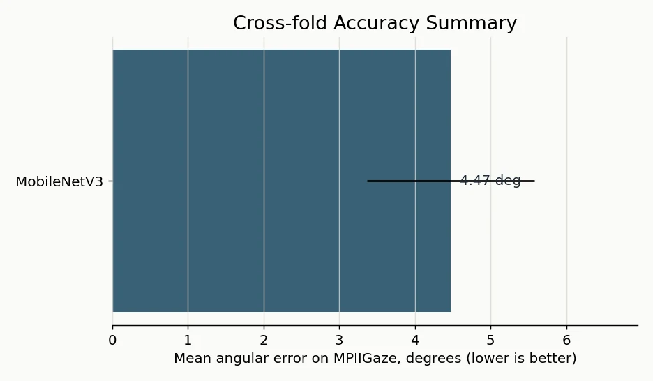
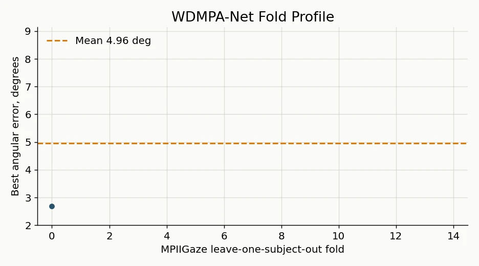
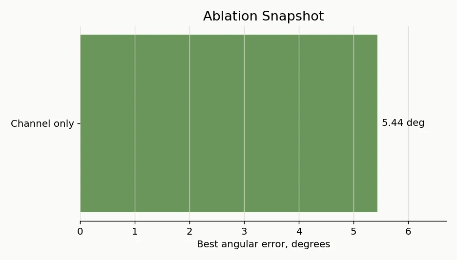

# WDMPA-Net

WDMPA-Net is a compact PyTorch project for appearance-based gaze estimation. It
implements a wavelet downsampling and multi-scale attention network, plus the
training, evaluation, ablation, export, and Jetson benchmarking utilities used
around the experiments.

The repository is now organized as a source-first research artifact: model code,
reproducible commands, lightweight result summaries, and README visualizations
are kept in Git; datasets, checkpoints, training runs, logs, and exported engines
are intentionally excluded.

## Visual Summary







## Highlights

- WDMPA-Net predicts `(pitch, yaw)` gaze angles from normalized RGB face crops.
- The model combines Adaptive Weighted Wavelet Downsampling (AWWD), Multi-scale
  Parallel Attention (MPA), and StarNet-style multiplicative feature blocks.
- Training supports MPIIGaze leave-one-subject-out folds and Gaze360
  train/validation/test splits.
- Baseline models are included for comparison: MobileNetV3, ShuffleNetV2,
  ResNet-style gaze heads, and L2CS-compatible evaluation.
- Export and Jetson scripts support ONNX, TensorRT, latency, memory, and thermal
  stability checks.

## Project Layout

```text
WDMPA/
|-- wdmpa/
|   |-- models/              # WDMPA-Net, ablation variants, baselines
|   |-- modules/             # AWWD, MPA, Star blocks
|   |-- data/                # MPIIGaze and Gaze360 dataset loaders
|   `-- utils/               # losses and angular-error metrics
|-- tools/
|   |-- train.py             # training entry point
|   |-- eval.py              # evaluation for WDMPA and baselines
|   |-- export.py            # single-model ONNX export
|   `-- export_all.py        # batch export for deployment comparison
|-- scripts/                 # experiment orchestration helpers
|-- deploy/
|   |-- jetson/              # Jetson Nano benchmark and TensorRT tools
|   `-- scripts/             # packaging and export helpers
|-- configs/                 # example MPIIGaze and Gaze360 configs
|-- assets/readme/           # small WebP summaries used in this README
|-- pyproject.toml
`-- requirements.txt
```

## Model Architecture

The main model is `wdmpa.models.wdmpa_net.WDMPANet`.

1. A stride-2 convolution stem maps an RGB input to the base channel width.
2. Four stages repeatedly downsample features with AWWD.
3. Each stage applies Adaptive Star Blocks. These blocks use element-wise
   multiplication for feature interaction and then apply MPA.
4. A linear head returns two continuous gaze angles: pitch and yaw in degrees.

Core modules:

| Module | File | Purpose |
| --- | --- | --- |
| `AWWD` | `wdmpa/modules/awwd.py` | Learns Haar-style low/high-frequency downsampling and fuses detail bands. |
| `MPA` | `wdmpa/modules/mpa.py` | Combines squeeze-excitation channel attention with multi-dilation spatial attention. |
| `AdaptiveStarBlock` | `wdmpa/modules/star_block.py` | Adds MPA to StarNet-style multiplicative blocks. |
| `WDMPANetAblation` | `wdmpa/models/ablation.py` | Switches downsampling and attention components for ablation studies. |

Default input convention:

- Shape: `(batch, 3, 224, 224)`
- Color space: RGB
- Tensor dtype: floating point
- Normalization: ImageNet mean and standard deviation in the dataset loaders
- Output: `(batch, 2)` as `[pitch_deg, yaw_deg]`

## Experimental Snapshot

The final local CSV/log/checkpoint artifacts were removed to keep the repository
small. The following numbers were copied from the completed MPIIGaze summaries
before cleanup.

| Model | Protocol | Mean angular error |
| --- | --- | ---: |
| MobileNetV3 | 15-fold MPIIGaze | 4.47 deg |
| ShuffleNetV2 | 15-fold MPIIGaze | 4.63 deg |
| WDMPA-Net | 15-fold MPIIGaze | 4.96 deg |
| L2CS official weights | 15-fold MPIIGaze re-evaluation | 5.94 deg |

WDMPA-Net fold range:

- Best fold: fold 0 at 2.68 deg
- Hardest fold: fold 3 at 8.25 deg
- Mean and standard deviation: 4.96 +/- 1.35 deg

Ablation observations from the retained summaries:

- Removing attention increased fold-0 error to 2.91 deg.
- Channel-only and spatial-only variants were worse than the full MPA variant in
  the fold-0 summary.
- Fixed AWWD and stride-convolution alternatives were close on the available
  folds, so deployment and latency results should be considered alongside
  accuracy when positioning the model.

These are research-run summaries, not packaged pretrained claims. Re-run the
commands below with your dataset copy and newly generated checkpoints before
reporting final paper numbers.

## Installation

Python 3.10 or newer is recommended.

```bash
git clone https://github.com/<owner>/<repo>.git
cd WDMPA
uv sync
uv pip install -e ".[train,export]"
```

If you do not use optional extras:

```bash
uv pip install -e .
```

## Quick Inference Smoke Test

```python
import torch

from wdmpa import WDMPANet

device = torch.device("cuda" if torch.cuda.is_available() else "cpu")
model = WDMPANet().to(device).eval()

image = torch.randn(1, 3, 224, 224, device=device)
with torch.inference_mode():
    gaze = model(image)

print(gaze.shape)  # torch.Size([1, 2])
```

To load a checkpoint generated locally:

```python
state = torch.load("runs/train/exp/best.pkl", map_location="cpu", weights_only=False)
model.load_state_dict(state, strict=False)
```

## Data Preparation

The loaders expect preprocessed face crops and label files:

```text
MPIIFaceGaze_Processed/
|-- Image/
`-- Label/
    |-- p00.label
    |-- p01.label
    `-- ...

Gaze360_Processed/
|-- Image/
`-- Label/
    |-- train.label
    |-- val.label
    `-- test.label
```

Dataset assumptions:

- Label gaze values are stored in radians and converted to degrees.
- MPIIGaze uses 15-fold leave-one-subject-out evaluation.
- MPIIGaze samples are filtered by `abs(pitch) <= 42` and `abs(yaw) <= 42`.
- Gaze360 samples are filtered by `abs(pitch) <= 60` and `abs(yaw) <= 60`.

## Training

Train one MPIIGaze fold:

```bash
PYTHONPATH=. uv run python tools/train.py \
  --model wdmpa \
  --data-root /path/to/MPIIFaceGaze_Processed \
  --dataset mpiigaze \
  --fold 0 \
  --epochs 60 \
  --batch-size 512 \
  --lr 1.6e-3 \
  --optimizer adamw \
  --output-dir runs/wdmpa \
  --name fold0
```

Train the 15-fold WDMPA experiment:

```bash
PYTHONPATH=. bash scripts/train_wdmpa_15folds.sh
```

Train baselines and ablations:

```bash
PYTHONPATH=. bash scripts/run_all_experiments.sh
PYTHONPATH=. bash scripts/train_ablation_fold7.sh
```

Training writes checkpoints and logs under `runs/` and `results/`. Those paths
are ignored and should stay local unless you deliberately publish an external
release asset.

## Evaluation

Evaluate a WDMPA checkpoint:

```bash
PYTHONPATH=. uv run python tools/eval.py \
  --model wdmpa \
  --weights runs/wdmpa/fold0/best.pkl \
  --data-root /path/to/MPIIFaceGaze_Processed \
  --dataset mpiigaze \
  --fold 0 \
  --batch-size 256
```

Evaluate an L2CS-compatible checkpoint:

```bash
PYTHONPATH=. uv run python tools/eval.py \
  --model l2cs \
  --weights /path/to/l2cs/fold0.pkl \
  --data-root /path/to/MPIIFaceGaze_Processed \
  --dataset mpiigaze \
  --fold 0
```

## Export And Edge Benchmarking

Export a checkpoint to ONNX:

```bash
PYTHONPATH=. uv run python tools/export.py \
  --weights runs/wdmpa/fold0/best.pkl \
  --output deploy/onnx/wdmpa_fold0.onnx \
  --simplify
```

Export comparison models:

```bash
PYTHONPATH=. uv run python tools/export_all.py \
  --weights-dir runs/wdmpa/fold0 \
  --output-dir deploy/onnx \
  --fold 0
```

Benchmark on Jetson:

```bash
uv run python deploy/jetson/benchmark.py \
  --model deploy/onnx/wdmpa_fold0.onnx \
  --warmup 100 \
  --iterations 1000
```

Build a TensorRT engine on Jetson:

```bash
bash deploy/jetson/build_tensorrt.sh deploy/onnx/wdmpa_fold0.onnx deploy/engines fp16
```

## Artifact Policy

The cleaned repository does not track:

- datasets and processed face crops
- checkpoints and pretrained weights (`*.pkl`, `*.pt`, `*.pth`, `*.ckpt`)
- `runs/`, training logs, TensorBoard data, and local result CSVs
- ONNX, TensorRT, and other generated deployment binaries
- local virtual environments and Python cache files

Small README assets under `assets/readme/` are kept because they summarize the
completed experiments without carrying bulky artifacts.

## Development Notes

Recommended checks:

```bash
uv run ruff format
uv run ruff check
uv run pytest -x -q
```

The current project favors reproducibility over packaged pretrained weights.
When publishing a result, record the dataset version, fold split, checkpoint path,
training hyperparameters, dependency versions, CUDA/cuDNN details, and any
nondeterminism caveats.

## License

This project is released under the MIT License. See `LICENSE`.

## Citation

No final bibliographic metadata is included in this repository. Add the accepted
paper citation here after publication rather than using placeholder DOI or venue
information.
